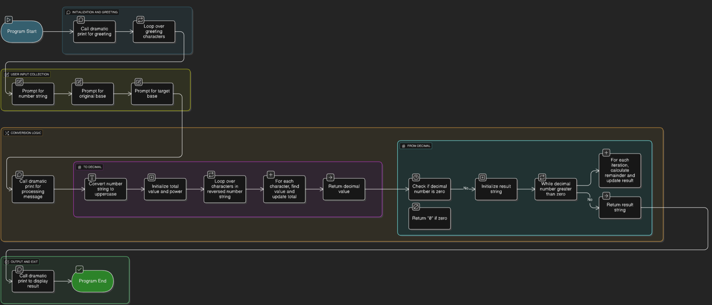

# Hexorcist

The **Hexorcist** is an interactive program where users can be told if they're failing class or not 

---

## Features  
- A functional calculator 
- Simple, text-based interface  
- Educational tool for learning 

---

## Installation  

1. Clone the repository:  
   ```bash
   git clone https://github.com/WTCSC/the-overly-verbose-gpa-calculator-Eclipse0-Gum.git
   cd the-meh-thematical-calculator-Eclipse0-Gum


## Flowchart 

A flow chart of the process:

